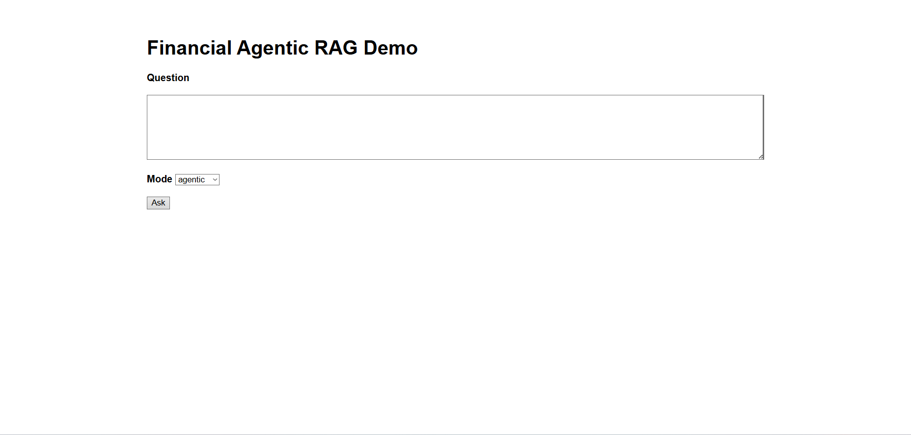
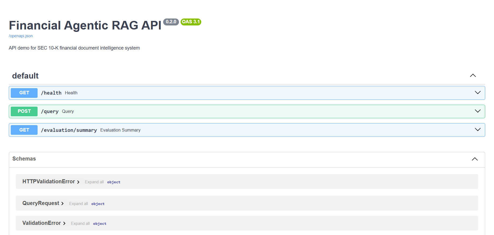
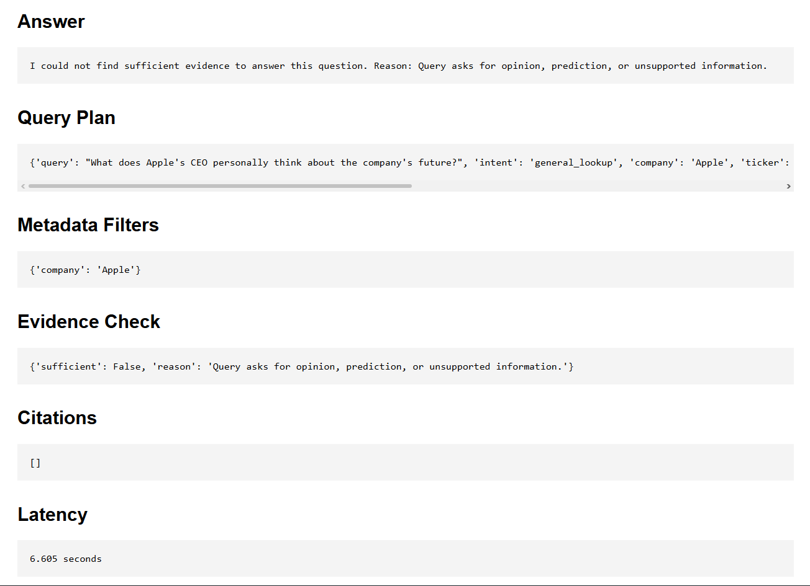

# AI Document Intelligence System (Agentic RAG)

Production-oriented financial document intelligence system using SEC 10-K filings, metadata-aware retrieval, reranking, and evidence sufficiency validation.


## Demo

### Flask Demo UI



Features shown:

* financial question answering
* query planning
* metadata-aware retrieval filters
* evidence sufficiency validation
* citation-based responses


### FastAPI Swagger Docs
Access: http://127.0.0.1:8000/docs


Available endpoints:

* `GET /health`
* `POST /query`
* `GET /evaluation/summary`


### Evaluation Comparison

Comparison between:

```text
Baseline Financial RAG
vs
Agentic Metadata-Aware Financial RAG
```


### Insufficient Evidence Handling



Example query:

```text
What does Apple's CEO personally think about the company's future?
```

The system detects unsupported or opinion-based questions and returns an insufficient-evidence response instead of generating unsupported answers.


## Key Features

### Financial Document Intelligence Pipeline

* SEC 10-K parsing pipeline
* section-aware chunking
* metadata-enriched embedding
* Qdrant vector retrieval
* cross-encoder reranking
* extractive RAG with citations

### Agentic Retrieval Layer

* rule-based query planner
* metadata-aware retrieval filters
* evidence sufficiency checker
* insufficient-evidence handling

### Evaluation Framework

* Hit@1 / Hit@5 / Hit@10
* MRR (Mean Reciprocal Rank)
* citation coverage
* insufficient-evidence accuracy
* baseline vs agentic comparison

### API & Demo

* FastAPI serving layer
* Flask demo UI
* cross-device local network access


## Architecture

### Offline Indexing Pipeline

```text
SEC 10-K PDFs
  ↓
Ingestion
  ↓
SEC-aware Parsing
  ↓
Section-aware Chunking
  ↓
Embedding
  ↓
Qdrant Vector Store
````

### Online Query Pipeline

```text
User
  ↓
Flask Demo UI
  ↓
FastAPI API Layer
  ↓
Agentic RAG Pipeline
  ├── Query Planner
  ├── Metadata Filter Builder
  ├── Retrieval from Qdrant
  ├── Cross-Encoder Reranking
  ├── Evidence Sufficiency Checker
  └── Extractive RAG + Citations
```


## Baseline vs Agentic Evaluation

### Baseline Financial RAG

| Stage     | Hit@1 | Hit@5 | MRR  |
| --------- | ----- | ----- | ---- |
| Retrieval | 0.54  | 0.88  | 0.69 |
| Reranking | 0.77  | 0.94  | 0.85 |

### Agentic Metadata-Aware Financial RAG

| Metric            | Score |
| ----------------- | ----- |
| Retrieval Hit@1   | 0.88  |
| Retrieval Hit@5   | 0.98  |
| Retrieval MRR     | 0.93  |
| Citation Coverage | 0.92  |

Agentic improvements mainly target:

* SEC section targeting
* year-specific retrieval
* metadata-aware filtering
* insufficient-evidence detection


## Tech Stack

### Core

* Python
* PyYAML
* Dataclasses

### Document Processing

* Docling
* Custom SEC-aware parser

### Retrieval & Embedding

* SentenceTransformers
* CrossEncoder reranking
* Qdrant Vector Database

### API & Demo

* FastAPI
* Flask

### Evaluation

* Hit@K
* MRR
* Citation coverage evaluation

### Infrastructure

* Docker
* Qdrant


## How to Run

### 1. Create virtual environment

```bash
python -m venv .venv
.venv\Scripts\Activate.ps1
pip install -r requirements.txt
```

### 2. Start Qdrant

```bash
docker run -p 6333:6333 -p 6334:6334 qdrant/qdrant
```

### 3. Build the Financial Vector Store

Run the indexed financial document pipeline before starting the API or demo.

```bash
python scripts/financial_baseline/run_vectorstore.py
```


### 4. Start API

```bash
uvicorn api.main:app --reload
```

### 5. Start Flask demo

```bash
python demo/app.py
```


## Project Structure

```text
Agentic-RAG-Document-Intelligence/
├── agentic/
│   ├── query_planner.py
│   ├── metadata_filter.py
│   ├── evidence_checker.py
│   └── pipeline.py
├── api/
│   └── main.py
├── chunking/
├── configs/
│   └── corpora/
│       └── financial_reports.yaml
├── demo/
│   └── app.py
├── docs/
├── embedding/
├── evaluation/
│   ├── pipeline.py
│   └── agentic_pipeline.py
├── ingestion/
├── parsing/
├── rag/
├── reranking/
├── retrieval/
├── schemas/
├── scripts/
│   ├── financial_baseline/
│   └── financial_agentic/
├── tests/
├── utils/
└── vectorstore/
```


## Engineering Highlights

* Built modular end-to-end RAG pipeline from ingestion to evaluation
* Implemented SEC-aware financial document parser
* Added metadata-aware retrieval filtering on top of semantic vector search
* Integrated Qdrant vector retrieval with cross-encoder reranking
* Designed evaluation framework for baseline vs agentic retrieval comparison
* Implemented insufficient-evidence validation to reduce unsupported answers
* Exposed the RAG pipeline through FastAPI and Flask demo layers


## Additional Documentation

* [Architecture Details](docs/architecture.md)
* [Evaluation Details](docs/evaluation.md)
* [Engineering Decisions](docs/engineering-decisions.md)
